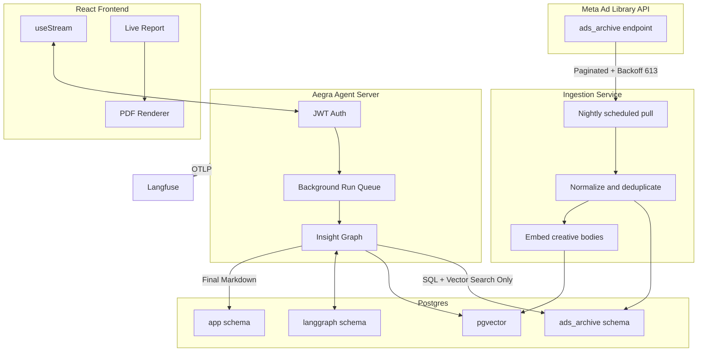

# BossAd — Agentic Ad-Intelligence Platform: Technical Architecture

**Engagement:** Principal Architect review — Meta Ad Library → Product Insight Engine
**Date:** 2026-07-01 (all tool/pricing facts verified via web research on this date; sources and retrieval dates cited inline)
**Status:** Recommended architecture for v1 → scale, decision record

---

## 1. Executive Summary

The recommended stack, no hedging:

- **Agent runtime: LangGraph OSS graphs served by Aegra** (Apache-2.0, LangGraph-SDK-compatible agent server, Postgres-backed) in a Docker container. Zero license cost, drop-in migration path to LangSmith Deployments if you ever want managed.
- **Frontend: React** (not Angular) with **`useStream` from `@langchain/react`** — it alone covers v1's agent-driven UI: token streaming, tool-call visibility, interrupts, thread rejoin, time-travel forking. **CopilotKit is not needed for v1.**
- **Persistence: one Postgres instance** for everything — LangGraph checkpoints, ad archive, users, job state — with **pgvector** enabled from day one (justified now, see §4.5).
- **Ingestion: scheduled background pulls** from the Meta Ad Library API into your own Postgres archive; agents **never** hit Meta's API directly at request time. The 200 calls/hour rate limit makes on-demand pull a non-starter.
- **Long-running runs:** handled natively by the Aegra/LangGraph Server run model (background runs + SSE streaming + reconnect). No Celery/Temporal at v1.
- **Report: Markdown as the canonical artifact** (agent writer node emits structured MD), rendered live in the browser and converted to PDF client-side with `@react-pdf/renderer` so the user watches the report build in real time.
- **Observability: Langfuse** (MIT, free self-host or free cloud tier at 50k observations/mo) via OTLP — Aegra supports any OTLP backend natively. Not LangSmith (self-host is Enterprise-only, ~$100k/yr contracts reported).
- **Hosting: Railway** (~$20–40/mo all-in at pilot volume): Aegra container + Postgres + cron ingestion worker; frontend on Vercel/Cloudflare Pages free tier.

⚠️ **One finding that outranks every architecture decision in this document:** the Meta Ad Library API returns **commercial (non-political) ads only for ads delivered to the EU/UK**. Targeting metadata (`target_locations`, `target_gender`, `target_ages`) exists **only for EU/UK-delivered ads**. If your customers' target zones are outside the EU/UK, the official API cannot serve Scenarios A/B/C as specified. See §4.5 and Open Questions (§9). Confirm the target geography before building anything.

---

## 2. Decision Matrix

| #   | Decision          | Options considered                                                                                                 | Cost @ low vol                                                                                                                   | Ops complexity                                 | Scalability                                      | Verdict                                       |
| --- | ----------------- | ------------------------------------------------------------------------------------------------------------------ | -------------------------------------------------------------------------------------------------------------------------------- | ---------------------------------------------- | ------------------------------------------------ | --------------------------------------------- |
| 4.1 | Agent runtime     | **Aegra (self-hosted)** / LangGraph Platform Plus / LangGraph Platform self-hosted / custom FastAPI+queue    | $0 license, ~$10–20 infra / $0.001 per node + $39/mo LangSmith + standby fees / Enterprise license only / $0 but weeks of build | Low (Docker Compose) / Lowest / High / Highest | Horizontal via more containers + shared Postgres | **Aegra**                               |
| 4.2 | Streaming UI      | **`useStream`/`injectStream` alone** / + CopilotKit / hand-rolled SSE                                    | $0 / $0 (OSS) but extra dependency / dev time                                                                                    | Low / Medium / High                            | All fine                                         | **`useStream` alone** (React)         |
| 4.3 | Graph shape       | **One graph, conditional branch A→B, C shares subgraphs** / three separate graphs / single ReAct supervisor | —                                                                                                                               | —                                             | —                                               | **One graph, explicit multi-node**      |
| 4.4 | Checkpointing     | **Postgres** / SQLite / Redis / in-memory                                                                    | ~$5–10/mo (shared instance)                                                                                                     | Low                                            | Proven to thousands of threads                   | **Postgres** (Aegra requires it anyway) |
| 4.5 | Ingestion         | **Scheduled background + archive** / on-demand per request                                                   | Cron worker ≈ $5/mo                                                                                                             | Low                                            | Rate-limit-immune                                | **Scheduled + archive-on-fetch**        |
| 4.5 | Vector store      | **pgvector in same Postgres** / dedicated vector DB (Pinecone/Qdrant) / none                                 | $0 marginal / $70+/mo / —                                                                                                       | None / Medium / —                             | Fine to ~5–10M vectors                          | **pgvector now**                        |
| 4.6 | Job orchestration | **Aegra background runs + SSE** / Celery+polling / Temporal                                                  | $0 / +Redis + worker / +cluster                                                                                                  | Low / Medium / High                            | Queue is Postgres-backed, exactly-once           | **Aegra-native runs**                   |
| 4.7 | Report            | **MD artifact + live client-side PDF** / server-side PDF / web dashboard                                     | $0 / +headless-Chrome worker / +build time                                                                                       | Low                                            | Move PDF server-side at scale                    | **MD + `@react-pdf/renderer`**        |
| 4.8 | Observability     | **Langfuse** (OTLP) / LangSmith / none                                                                       | Free (50k obs/mo cloud, or MIT self-host) / $39/seat + $0.50/1k traces / —                                                      | Low / Lowest / —                              | Langfuse Core $29/mo when outgrown               | **Langfuse**                            |
| 4.9 | Hosting           | **Railway** / Fly.io / Render / Hetzner VPS                                                                  | ~$20–40/mo / ~$20–35/mo / ~$50–60/mo / ~€6/mo                                                                                | Lowest / Low-Med / Low / High                  | Fly cheapest at scale                            | **Railway v1 → Fly.io at growth**      |

---

### 3. Recommended Architecture




Data flow: Meta → scheduled ingestion → Postgres archive (+pgvector) → agent graph reads *only* the local archive → streams reasoning/tokens over SSE to `useStream` → writer node emits the Markdown report → browser renders it live and produces the PDF in front of the user.

---

## 4. The Decisions

### 4.1 Agent runtime / deployment — **Aegra, self-hosted**

**Verified facts (2026-07-01):**

- **LangGraph OSS** is MIT and free, but the *library* is not the *server*. `useStream`/`injectStream` speak the LangGraph Server / Agent Protocol API (threads, runs, SSE endpoints). The official LangGraph Server binaries for production self-hosting require a license key: a LangChain forum staff response (thread "Best practices for self-hosting LangGraph Server OSS without LangGraph keys") states plainly that production self-hosted deployment requires an Enterprise license key; `langgraph dev` is dev-only. The self-hosted standalone-server docs confirm `LANGGRAPH_CLOUD_LICENSE_KEY` plus egress to `beacon.langchain.com` for license verification.
- **LangGraph Platform** (now branded **LangSmith Deployments**): Developer tier is free self-hosted up to 100k nodes/month, 1 seat, dev-grade, no custom auth. Plus is usage-based: **$0.001/node executed + standby minutes ($0.0007/min dev, $0.0036/min prod ≈ $155/mo for one always-on prod deployment) + mandatory LangSmith Plus at $39/user/mo** (zenml.io/blog/langgraph-pricing, metacto pricing deep-dive, both current 2026).
- **Aegra** (github.com/aegra/aegra, aegra.dev): Apache-2.0, positions itself as a drop-in replacement for LangSmith Deployments — same LangGraph SDK, same client APIs, Postgres persistence, SSE streaming, background runs, **custom auth handlers (JWT/OAuth/Firebase)**, OTLP tracing to any backend, Docker Compose quick start, PyPI-published API + CLI, 49 GitHub releases, CI + Codecov, Discord community, explicitly documents compatibility with Agent Chat UI, LangGraph Studio, and AG-UI/CopilotKit. This is a young project (2025-origin) but an active, structured one — and critically, it is a *thin server shell*: your graphs are pure LangGraph OSS code.
- **Custom FastAPI + Celery/Arq**: you would re-implement threads, runs, checkpoint wiring, SSE resumability, and interrupt semantics yourself — and lose `useStream` compatibility entirely (a Stack Overflow thread confirms `useStream` expects the full server API surface: `/threads`, `/runs`, etc.). That's 2–4 weeks of undifferentiated plumbing plus permanent maintenance, for a solo founder.

**Decision: Aegra.**

- **Cost at low volume:** $0 license; runs in one container next to Postgres.
- **Checkpointing/persistence:** Postgres checkpoints out of the box (same `langgraph-checkpoint-postgres` machinery).
- **HITL/interrupts:** supported — it implements the same run/interrupt API the SDK expects, which is exactly what the premium tier (HITL, time travel, forks) will need later. You build v1 on the same primitives.
- **Migration pain if outgrown:** lowest of all options. Because the client SDK and graph code are identical, migrating to managed LangSmith Deployments is a config change (apiUrl + auth), not a rewrite. That is the escape hatch if Aegra stagnates.

**Rejected:**

- *LangGraph Platform Plus* — violates the no-platform-license constraint: ~$155/mo standby before a single run, plus $0.001/node (a 50-node research run × 1,000 runs/mo = $50 just in node fees), plus $39/mo LangSmith. Revisit trigger: you have revenue, >3 engineers, and ops toil on the agent server exceeds ~2 days/month.
- *Custom FastAPI + queue* — maximum build cost, kills `useStream`, no feature you actually need is missing from Aegra. Revisit trigger: Aegra abandoned **and** LangChain pricing still unacceptable — then you fork Aegra (Apache-2.0) rather than start from scratch.

**Change-my-mind triggers:** Aegra loses maintenance momentum (no release in 6 months) → migrate to LangSmith Deployments Plus (budgeted, painless) or fork. You raise a round and want zero infra ops → LangSmith Deployments.

### 4.2 Streaming & interactive UI — the named blocking question

**Direct answer: yes — `useStream` alone covers this product's v1 UI needs. CopilotKit is not required.** Verified against current docs (docs.langchain.com frontend guides + reference.langchain.com, retrieved 2026-07-01):

What `useStream` (now shipped as **`@langchain/react`**, alongside `@langchain/vue`, `@langchain/svelte`, and `@langchain/angular`'s **`injectStream`**) gives you out of the box:

| Need                                                     | Covered?     | Mechanism                                                                                                                                                                                                       |
| -------------------------------------------------------- | ------------ | --------------------------------------------------------------------------------------------------------------------------------------------------------------------------------------------------------------- |
| Token streaming                                          | ✅           | `stream.messages` (messages mode), custom channels via `streamMode: "custom"` for non-message progress events                                                                                               |
| Tool-call visibility (agent's plan, live research steps) | ✅           | `stream.toolCalls` updates in real time; `getToolCalls(message)` for inline rendering; tool *progress* events when stream mode includes `"tools"`                                                       |
| Interrupts / HITL / resume                               | ✅           | `stream.interrupt` + `stream.submit(null, {command: {resume}})` — exactly the premium-tier approval-card pattern, documented verbatim                                                                      |
| Multi-turn thread state                                  | ✅           | `threadId`/`onThreadId`, `values`, full branch history                                                                                                                                                    |
| Long-run resilience (user closes tab mid-run)            | ✅           | background runs +`joinStream`/rejoin: remount with the same `threadId` and the hook reattaches to the in-flight run — this is the killer feature for 30s–minutes runs                                     |
| Time travel / forks (premium)                            | ✅           | `stream.submit({}, {forkFrom: {checkpointId}})` + `client.threads.getHistory()`                                                                                                                             |
| Custom network layer                                     | ✅           | pluggable transports (`FetchStreamTransport`) since LangGraph v1                                                                                                                                              |
| Auth                                                     | ⚠️ partial | The hook passes headers/API keys, but authentication itself is server-side —**Aegra's custom auth handlers close this gap** (this is precisely what the free LangSmith Deployments tiers don't give you) |
| Pre-built chat components                                | ❌           | Headless by design — you bring your own UI. For this product that's a feature: v1 is*not* a chat app, it's an agent-progress + live-report view                                                              |
| Bidirectional shared-state / generative UI widgets       | ❌           | This is CopilotKit/AG-UI territory                                                                                                                                                                              |

**When CopilotKit would re-enter:** only if the premium tier evolves into agent-and-user co-editing shared application state (AG-UI-style bidirectional canvas) rather than approve/reject interrupts. Interrupt-based HITL, time travel, and forks are all native to `useStream` — CopilotKit adds nothing for those. Hand-rolled SSE is strictly worse than both: you'd rebuild reconnect, branching, and interrupt plumbing for zero gain.

**React vs Angular (you asked me to decide): React.** `injectStream` is real, current, and at feature parity (Signals-first, `forkFrom`, interrupts — all verified in the docs, 2026-07-01), so Angular would *work*. React wins on the surrounding ecosystem, which matters more than the hook itself: the live-PDF requirement is served by `@react-pdf/renderer` (mature in-browser PDF rendering with live preview — no Angular equivalent of comparable maturity); every agent-UI library you might want later (CopilotKit, assistant-ui, AG-UI clients, Agent Chat UI as a reference implementation) is React-first; `useStream` React is the reference implementation and gets fixes first (the Angular SDK is the newest of the four). Change-my-mind trigger: your team is already deeply Angular-skilled — team fluency beats ecosystem breadth for a solo/small team. Otherwise: React.

### 4.3 Agent design pattern — one graph, explicit nodes, conditional branching

**One graph, not three.** A and B are the same investigation with a different verdict — B is *defined* as the fallback when A finds no clear winner, and needs A's full evidence state (what was searched, what was ruled out, saturation signals). Modeling them as separate graphs would force state serialization between them for no benefit. C shares the retrieval/analysis machinery and differs only at intake (no product list) and synthesis. One graph = one deployment, one thread per user session, shared checkpointing, and the A→B transition is just a conditional edge — invisible to infra, visible in the reasoning trail.

**Explicit multi-node graph, not a single supervisor-with-tools.** The reasoning-transparency requirement decides this. A ReAct supervisor's "plan" lives inside prompt scratchpads — opaque, unstreamable as structure. An explicit planner → retriever → analyst → writer graph puts every reasoning stage in *typed graph state*, which `useStream` streams as `values` updates — the UI renders the plan, the evidence table, and the elimination log as first-class objects, not parsed prose. It also checkpoints at meaningful boundaries (resume after a failed node, not restart) and gives Langfuse clean per-node cost attribution.

**Scenario A/B/C graph sketch:**

```python
class InsightState(TypedDict):
    # intake
    scenario: Literal["A", "B", "C"]      # A/B share entry; C = no product list
    products: list[ProductSpec] | None    # None => scenario C
    zone: Zone                            # country + region/city (+ radius, see §4.5 caveat)
    gender: str | None
    # working state (all streamed to UI via `values`)
    research_plan: list[PlanStep]
    evidence: list[AdEvidence]            # scored ads from local archive
    market_map: MarketMap                 # per-candidate signals: runtime-days, reach, saturation
    eliminations: list[Elimination]       # ruled-out products + reasons  ← the reasoning trail
    verdict: Verdict | None               # winner | no_clear_winner | greenfield_proposal
    coaching: CoachingAdvice | None       # scenario B output
    report_md: str                        # final artifact

g = StateGraph(InsightState)

g.add_node("intake",   validate_and_scope)       # parse inputs, resolve zone → archive filter
g.add_node("clearing", scope_dataset)            # SQL filter: zone, gender, recency  (§4.5)
g.add_node("planner",  make_research_plan)       # LLM: emits typed PlanStep list → UI shows plan
g.add_node("retrieve", run_plan_step)            # archive SQL + pgvector similarity, NO Meta calls
g.add_node("analyst",  score_evidence)           # per-candidate signals; appends eliminations
g.add_node("verdict",  decide)                   # winner? → structured Verdict w/ signal citations
g.add_node("coach",    suggest_or_coach)         # B: pgvector "similar winners" OR execution advice
g.add_node("discover", greenfield_synthesis)     # C: cluster archive activity → opportunity
g.add_node("writer",   write_report_md)          # streams MD tokens → live report pane

g.add_edge(START, "intake")
g.add_edge("intake", "clearing")
g.add_edge("clearing", "planner")
g.add_edge("planner", "retrieve")
g.add_conditional_edges("retrieve", plan_done,          # loop until plan exhausted / budget cap
    {"more": "retrieve", "done": "analyst"})
g.add_conditional_edges("analyst", needs_more_evidence, # analyst may extend the plan (bounded)
    {"more": "planner", "done": "verdict"})
g.add_conditional_edges("verdict", route_verdict, {
    "winner":          "writer",    # Scenario A resolves
    "no_clear_winner": "coach",     # ← Scenario B is a conditional edge, not a pipeline
    "greenfield":      "discover",  # Scenario C path (products is None)
})
g.add_edge("coach", "writer")
g.add_edge("discover", "writer")
g.add_edge("writer", END)
```

Premium-tier hooks cost nothing now: `interrupt()` before `verdict` (let the user challenge the shortlist) and `forkFrom` any checkpoint (re-run with a different zone) are one-line additions because the checkpointer and server API already support them.

Bound the loops: `plan_done` and `needs_more_evidence` must enforce hard caps (max plan steps, max node count, token budget) — this is your primary runaway-cost defense (§4.8).

### 4.4 State, memory, checkpointing — **Postgres, day one**

This decision is made for you by 4.1: Aegra requires Postgres for threads/runs/checkpoints. Using anything else in parallel would be *adding* a database. One Postgres instance, three logical schemas (checkpoints / ad archive / app data) — one backup story, one connection string, ~$5–10/mo managed on Railway.

**Rejected:** SQLite (single-writer; breaks the moment the server runs >1 worker; no managed backups) — fine only for local dev, and `langgraph-checkpoint-sqlite` makes local dev easy. Redis-as-checkpointer (persistence semantics wrong for durable audit trails of reasoning; Redis enters later as pub/sub if you adopt the official server image, which uses it for stream fan-out). In-memory (no resumability — disqualified by requirements).

Minimum viable persistence = Postgres checkpointer + thread metadata. That already gives resumability, multi-turn, time travel, and forks. Long-term "memory" beyond threads (e.g., per-customer learned preferences) is premature — skip until premium.

### 4.5 Data ingestion & caching — scheduled background ingestion, archive-on-fetch, pgvector now

**Verified constraints of the Meta Ad Library API (retrieved 2026-07-01; admapix.com API guide updated Apr 2026, adlibrary.com limitations post, developers.facebook.com):**

1. **Coverage wall:** `/ads_archive` returns political/social-issue ads globally, but **commercial ads only where delivery touches the EU/UK** (retained 1 year). Commercial ads outside the EU return nothing via the API (they're visible in the web UI, but scraping that violates Meta ToS).
2. **Targeting fields wall:** `target_locations`, `target_gender`, `target_ages` are available **only for EU/UK-delivered ads**. Your zone/radius/gender scoping is only implementable on EU/UK data.
3. **No radius queries:** the API filters by `ad_reached_countries` (country level). Zone/radius scoping must be computed *post-hoc* from `target_locations` (city/region granularity, EU/UK only). A literal "radius around a point" is an approximation you compute yourself (geocode `target_locations` entries, test distance). Radius smaller than city granularity is not honestly answerable — say so in the product.
4. **No spend/performance for commercial ads:** you get `eu_total_reach` (single number) and delivery dates. No impressions buckets, no spend (those are political-ads-only). **Ad longevity (days running) is the primary "winning" signal** — advertisers don't keep paying for losers. This reframes the analyst node's scoring model.
5. **Rate limit:** ~200 calls/hour per user access token (rolling window); throttling is cost-based (large field projections hit it sooner); error code 613 → back off ≥60s. Access requires Facebook identity verification (days of lead time — start now).
6. **Data disappears:** non-political ads vanish 1 year after last impression. **Your own archive is the only durable history** — and over time it becomes your moat and your defense against constraint #1.

**Decision: scheduled background ingestion.** On-demand pull is arithmetically dead: one agent run doing live research would burn 20–50 paginated calls; at 200/hr that's 4–10 concurrent users before every run stalls on rate limits — and every run would pay Meta-API latency inside the reasoning loop. Instead:

- **Nightly batch** per tracked zone/category: incremental pulls keyed on `ad_delivery_date_min`, narrow search terms, cursor pagination with checkpoint-on-cursor (resume after 613), exponential backoff, archive-on-every-fetch (append snapshots keyed on `ad_id` + date; never overwrite — reach history over time is itself a signal).
- **On-demand top-up queue:** when a user requests a zone you don't track yet, enqueue an ingestion job (bounded to the rate budget), stream "gathering fresh data for your zone (~N min)" via the custom stream channel, and let the agent proceed on whatever is already cached. Staleness tolerance: ad-market dynamics move in days, not minutes — 24h-old data is fine, and the report states its data-freshness window.
- The **weekly Ad Library Report CSV** (bulk, doesn't consume API quota) seeds broad coverage cheaply.

**Vector store: pgvector, yes, now.** Scenario B's "similar/adjacent products performing well" is a launch requirement of a launch scenario, not a future feature — and it's a semantic-similarity query over ad creative text (embed `ad_creative_bodies` + product descriptors at ingestion time; cosine search filtered by zone/recency at query time). pgvector adds this for $0 inside the Postgres you already run, no new service, no sync pipeline. A dedicated vector DB is premature below several million vectors / heavy QPS. Trigger to revisit: vector search p95 > ~500ms at your filter selectivity, or the archive passes ~5–10M embedded ads.

### 4.6 Compute & job orchestration — the runtime already solves this

The 30s–minutes problem is precisely what the LangGraph Server run model (which Aegra implements) exists for, so the answer to "how do long runs reconcile with request/response" is: **they never meet.** The flow:

1. Frontend `stream.submit()` → `POST /threads/{id}/runs` returns immediately; the run executes as a **background run** on the server, its queue state in Postgres with exactly-once semantics.
2. Progress streams over **SSE** — tokens, tool calls, node-boundary `values` updates, custom progress events.
3. Disconnects don't kill the run. The run continues server-side; the client rejoins via the same `threadId` (`useStream` reattachment, verified in the join/rejoin docs). Every node boundary is checkpointed, so even a server restart resumes from the last checkpoint instead of restarting the run.

**No Celery, no Temporal at v1.** The only thing outside this model is ingestion (§4.5), which is a cron container (Railway cron / APScheduler) writing to Postgres — it never talks to the agent server.

**Concurrency ceiling of the cheap path, and what breaks first:** one Aegra container (2 vCPU / 2–4GB) comfortably holds on the order of 50–100 concurrent runs, because agent runs are I/O-bound (awaiting LLM APIs) — Python async handles that; CPU is not the constraint. What breaks first, in order: (1) **Postgres connection pool** (each worker × concurrent runs; fix: PgBouncer, ~an hour of work), (2) checkpoint-write throughput on a $5 Postgres (fix: bigger instance), (3) single-container blast radius (fix: run N Aegra containers behind Railway's LB — stateless by design, shared Postgres; this is horizontal scaling without a rewrite). LLM-provider rate limits will likely bite before any of these.

### 4.7 Report generation & delivery — Markdown artifact, live PDF in the browser

- **Canonical artifact: Markdown**, produced by the `writer` node as structured MD with a fixed schema of sections (verdict, signal table, reasoning chain, eliminations, data-freshness note). MD is diffable, storable as a text column, re-renderable forever, and streams token-by-token.
- **Live experience:** the report pane renders the MD stream as it's written (`react-markdown`); alongside/after it, **`@react-pdf/renderer` builds the PDF client-side** so the user watches the document assemble — your stated requirement — with a download button at completion. Zero server cost: the browser is the PDF engine.
- **Persistence:** final MD stored in Postgres (app schema) linked to the thread ID (report ↔ full reasoning trail forever); optionally the PDF blob to R2/S3 (~$0 at pilot volume).
- **At scale / premium:** move PDF rendering server-side (Gotenberg or Playwright-print worker) when you need emailed/scheduled reports or pixel-perfect branding — the MD artifact doesn't change, only the renderer. That is the designed migration seam.

**Rejected:** PDF-first generation server-side at v1 (adds a worker + headless Chrome for something the browser does free, and can't stream progressively as naturally); dashboard-as-report (higher build cost, and users of this product want a takeaway artifact they can share — a report *is* the product).

### 4.8 Observability & cost control — **Langfuse**, hard budgets in the graph

**Verified (2026-07-01):** Langfuse is MIT-licensed, free to self-host, cloud free tier 50k observations/mo (30-day retention), Core $29/mo, Pro $199/mo. LangSmith: free tier 5k traces/mo/1 seat, Plus $39/seat/mo + $0.50/1k traces; **self-hosting is Enterprise-only** (metacto's 2026 comparison reports $100k+/yr contracts). Aegra explicitly supports **any OTLP backend** — Langfuse plugs straight in; you are *not* locked to LangSmith the way Platform users are.

**Decision: Langfuse cloud free tier** at pilot (zero ops), with self-host as the known fallback if volume or data-residency demands it — same instrumentation either way, so it's a config change.

**Cost control (day one, in code, not dashboards):**

- Tag every trace with `user_id`, `scenario`, `thread_id` → Langfuse gives per-user/per-run token cost natively.
- **Hard budget caps inside the graph:** max plan steps, max total nodes per run (LangGraph recursion limit), and a token-budget accumulator in `InsightState` checked at each conditional edge — a runaway research loop self-terminates with a partial report, never a surprise bill.
- Per-plan quotas (runs/month per user) enforced in Aegra's auth layer.
- Model tiering: planner/analyst/writer on a frontier model; retrieval summarization and embedding on cheap models. This is typically a 5–10× cost lever at report quality parity.

### 4.9 Security, compliance, hosting

**Meta ToS:** Using the official Ad Library API within its scope (transparency data, rate limits respected) is the defensible path. Two bright lines: (1) **do not scrape the Ad Library web UI** to escape the EU-only commercial coverage — that's a ToS violation with litigation history in this space (Meta v. Bright Data was decided around scraping questions; don't be the test case), and third-party "all-ads" datasets are scraped, so buying them imports the same risk in vendor form — a business decision to make with eyes open, not an engineering default; (2) the API's identity-verification gate means your API access is tied to a real person's verified account — treat that token as a production secret and monitor for policy changes (Meta has tightened this API repeatedly). GDPR posture is light (ad data is corporate speech, not personal data; your user data is standard SaaS) — but note transparency data reuse restrictions in the ToS regarding republishing raw archives; your derived-insights model (reports, not data resale) is the right side of that line.

**Hosting: Railway at v1** (verified pricing 2026-07-01: Hobby $5/mo min, usage-based $0.0000077/vCPU-s; realistic pilot bill $20–40/mo for Aegra container + Postgres + cron worker; Pro $20/mo adds hard spend limits). Frontend static on Vercel or Cloudflare Pages free tier. Railway wins v1 on lowest ops surface (managed Postgres, cron, zero-config deploys from the repo).
**Next tier: Fly.io** — Machines have **no per-request timeout** (the natural fit for agent workloads, as 2026 platform comparisons consistently note), cheapest at scale ($60–90/mo at growth tier vs $80–120 Railway, and $0.02/GB egress), multi-region when latency matters. A single Hetzner VPS ~~(~~€6/mo) is the absolute-cheapest path but buys you unmanaged Postgres, backups, and patching — wrong trade for a solo founder whose scarce resource is attention.

---

## 5. Phased Roadmap

**Phase 0 — unblock (week 0, before any code):**
Meta identity verification + Ad Library API access (days of lead time). **Confirm target market geography (EU/UK or not) — this gates the entire product** (§9 Q1).

**Phase 1 — MVP (pilot, 0–50 users):**
Railway: 1 Aegra container + Postgres (pgvector on) + cron ingestion worker. React + `useStream` on Vercel free tier. One `insight_graph`, all three scenarios. Langfuse cloud free. MD report + client-side live PDF. JWT auth via Aegra custom auth handler. **Fixed cost ≈ $25–50/mo + LLM spend.**

**Migration triggers (each component, cheap → scalable):**

| Component              | Trigger                                                                    | Move to                                                                        |
| ---------------------- | -------------------------------------------------------------------------- | ------------------------------------------------------------------------------ |
| Single Aegra container | sustained >50 concurrent runs or deploy-downtime pain                      | N containers behind LB (config, not code)                                      |
| Railway Postgres       | connection exhaustion / checkpoint write latency                           | PgBouncer first, then dedicated Postgres (Neon/Supabase/Crunchy)               |
| Railway                | egress or compute bill > ~$150/mo, or need regions                         | Fly.io Machines                                                                |
| Client-side PDF        | emailed/scheduled reports on roadmap                                       | Gotenberg/Playwright render worker (MD artifact unchanged)                     |
| Langfuse cloud free    | >50k observations/mo                                                       | Core $29/mo, or self-host (MIT)                                                |
| pgvector               | >5–10M vectors or p95 >500ms                                              | Qdrant/dedicated — but re-benchmark first                                     |
| Aegra itself           | project stagnates (no release in 6 mo) OR you want zero ops post-funding   | LangSmith Deployments Plus — same SDK, config-level migration                 |
| Nightly ingestion      | customers demand <24h freshness or >~20 tracked zones saturate rate budget | multiple verified tokens / Ad Library Report CSV bulk lane / negotiated access |

**Phase 3 — target at scale (500+ users):** 3–5 Aegra replicas (K8s or Fly Machines) + Redis pub/sub for stream fan-out, dedicated Postgres + PgBouncer + read replica for the archive, server-side PDF workers, Langfuse self-hosted, premium tier (HITL interrupts, time travel, forks — **all already supported by the v1 primitives**; the premium tier is a frontend + entitlement project, not an infra project). No component above requires discarding the graph code, the SDK contract, the MD artifact, or the Postgres schema — that is the "no rewrite" guarantee, and it holds because every interface in this design (Agent Protocol API, OTLP, MD, SQL) is a standard rather than a vendor surface.

---

## 6. Risk Register (ranked by severity)

| # | Risk                                                                                                                  | Severity       | Likelihood                  | Mitigation                                                                                                                                                                                                           |
| - | --------------------------------------------------------------------------------------------------------------------- | -------------- | --------------------------- | -------------------------------------------------------------------------------------------------------------------------------------------------------------------------------------------------------------------- |
| 1 | **Meta API coverage**: commercial ads EU/UK-only; targeting fields EU/UK-only; product thesis breaks outside EU | 🔴 Critical    | Certain (it's current fact) | Confirm market geography now (§9 Q1); if non-EU is required, the data layer must be re-scoped (licensed datasets — with their own ToS risk — or product pivot). Archive aggressively to build proprietary history |
| 2 | **Meta API access/policy shift**: single verified-identity token; Meta has repeatedly tightened this API        | 🔴 High        | Medium                      | Archive-on-fetch (data outlives access); second verified token as warm spare; monitor platform-terms changes quarterly                                                                                               |
| 3 | **Aegra project risk**: young OSS, small team                                                                   | 🟠 Medium-high | Medium                      | Thin-shell architecture keeps graphs portable; documented escape hatches (LangSmith Deployments config-migration, or fork under Apache-2.0); 6-month release-cadence tripwire                                        |
| 4 | **Runaway LLM spend**                                                                                           | 🟠 Medium-high | High without controls       | In-graph hard budgets (§4.8) — ship in v1, not later; per-user quotas; Langfuse cost alerts                                                                                                                        |
| 5 | **Radius promise vs. city-granularity data**: product promises "radius," API gives city/region                  | 🟠 Medium      | Certain                     | Honest UX: zone = city/region; radius as computed approximation with stated granularity; don't let marketing write checks the data can't cash                                                                        |
| 6 | Single Postgres = SPOF                                                                                                | 🟡 Medium      | Low (managed, backed up)    | Railway automated backups; PITR when revenue justifies; it's also the first scaling seam (known fix)                                                                                                                 |
| 7 | LangChain-ecosystem churn (fast-moving SDKs;`@langchain/react` is new)                                              | 🟡 Medium      | Medium                      | Pin versions; the Agent Protocol API contract is the stable seam; upgrade deliberately, not automatically                                                                                                            |
| 8 | Vendor lock-in                                                                                                        | 🟢 Low         | —                          | Deliberately minimized: Apache/MIT stack, OTLP, SQL, MD artifact — every component has a named exit                                                                                                                 |

---

## 7. Cost Bands (directional, monthly, grounded in pricing verified 2026-07-01)

| Tier                                                       | Infra                                                                                                                                                                                       | Observability                                                                                    | LLM spend (dominant, scenario-dependent)                                      | Total band             |
| ---------------------------------------------------------- | ------------------------------------------------------------------------------------------------------------------------------------------------------------------------------------------- | ------------------------------------------------------------------------------------------------ | ----------------------------------------------------------------------------- | ---------------------- |
| **Pilot (0–50 users)**                              | Railway $20–40 (Aegra + PG + cron) + $0 frontend                                                                                                                                           | Langfuse free                                                                                    | ~$0.10–0.50/run (tiered models, budget-capped) × ~200–500 runs ≈ $30–250 | **~$50–300/mo** |
| **Early growth (50–500)**                           | $100–250 (2–3 containers, bigger PG, PgBouncer) or Fly ~$60–150                                                                                                                          | Langfuse Core $29 | $500–3,000                                                                  | **~$600–3,500/mo**                                                     |                        |
| **Scaled (500+)**                                    | $500–1,500 (replicas, dedicated PG + replica, Redis, PDF workers) | Langfuse Pro $199 or self-host                                                                                         | $5,000–25,000+ (now the business-model question, not an infra question) |**~$6k–27k/mo** |                                                                               |                        |
| *Counterfactual: LangGraph Platform Plus at growth tier* | *~$155 standby + $0.001/node (50-node runs × 5k runs = $250) + $39×2 seats ≈ $480/mo before hosting the rest* | *LangSmith incl.* | *same* | *adds ~$300–400/mo vs. Aegra path* |                                                                                                  |                                                                               |                        |

The controlling variable at every tier is LLM tokens, not infrastructure — which is why the §4.8 budget caps are v1 scope.

---

## 8. Key Assumptions (stated explicitly)

1. **"Clearing" = scoping/filtering** the archive to the user's zone/radius/gender before reasoning — not anonymization/compliance. Proceeding on this; it shaped the `clearing` node. (Flagged in §9 anyway — cheap to confirm.)
2. Target customers advertise in / care about **EU/UK markets** (everything in §4.5 depends on this — see Risk #1).
3. v1 users **watch** the agent (read-only progress + live report); interaction (HITL/forks) is premium-tier — per your note. This is why headless `useStream` without CopilotKit is sufficient.
4. Runs are session-shaped (user triggers, watches, gets report) — no scheduled/recurring reports in v1.
5. Solo/small founder team, Python-comfortable (LangGraph graphs + Aegra are Python; frontend TS/React).
6. ~30s–5min per run, ≤ low-hundreds of runs/day at pilot — well inside all stated limits.

## 9. Open Questions Back to You

1. **🔴 The blocking one — where are your customers' target zones?** EU/UK → this architecture works as designed. North Africa / Middle East / US / LATAM → the official API returns essentially no commercial ads there, and no targeting metadata; Scenarios A/B/C as specified are not buildable on official data alone. I need the honest answer before Phase 1.
2. **"Clearing"** — confirm assumption #1 (scoping, not compliance). One sentence from you settles it.
3. **Radius granularity** — is city/region-level zone targeting acceptable to the product (it's what the data supports), or is sub-city radius a hard promise to customers? (Determines UX copy and whether Risk #5 is a footnote or a problem.)
4. **Winning signal without spend data** — commercial ads expose `eu_total_reach` + longevity only (no spend/CTR). Is "sustained ad investment + reach in zone" an acceptable definition of "winning" for your customers, or do they expect performance metrics the data cannot provide? This shapes the analyst node's scoring rubric and the report's honesty.
5. **LLM provider preference / existing credits?** Changes nothing architecturally (graph is model-agnostic) but sets the cost-band midpoints.
6. **How many zones/categories should nightly ingestion track at launch?** The 200-calls/hr budget supports roughly 15–25 well-scoped zone×category slices per token per night; beyond that we plan the CSV-report bulk lane earlier.

---

*All framework/pricing claims verified 2026-07-01 via: docs.langchain.com (frontend SDK guides: overview, human-in-the-loop, time-travel, tool-calling, join-rejoin, custom-stream-channels; langgraph-v1 release notes; deploy-standalone-server), reference.langchain.com (UseStream, @langchain/angular), github.com/aegra/aegra + aegra.dev, forum.langchain.com (self-hosting license thread), zenml.io & metacto.com & pecollective.com (LangGraph/LangSmith pricing analyses, Mar–Apr 2026), admapix.com (Meta Ad Library API guide, updated 2026-04-16), adlibrary.com (API limitations, 2026), developers.facebook.com (Ad Library API reference), laminar.sh & metacto.com (Langfuse/LangSmith comparisons, 2026), techsy.io & northflank.com & birjob.com (Railway/Render/Fly pricing, 2026), copilotkit.ai (AG-UI/Generative-UI posts, Jan–Jun 2026).*
